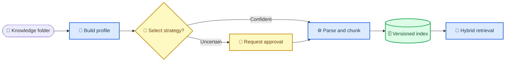

# PR-00000001: Knowledge Agent 与 RAG 文档基线

| 字段 | 值 |
| --- | --- |
| PR | [#1](https://github.com/myyyyyyz/Orbit/pull/1) |
| 作者 | `susz347` |
| 日期 | 2026-08-01 |
| 状态 | Draft |
| 分支 | `susz347:dev/knowledge` → `myyyyyyz:dev/optimize` |
| 提交 | `c04715e` |
| 部署策略 | 不适用；本 PR 不修改运行时代码 |

---

## 📝 摘要

本 PR 建立 Orbit Knowledge Agent 的文档化设计基线，并提供一份可用于向量数据库和 RAG 回归测试的虚构中文知识库。目标不是让模型随意调参，而是先分析 `knowledge/` 文件夹中的文件画像，再从受控策略目录选择解析、切块、嵌入和检索策略。

本次仅新增文档，不改变 API、数据库、向量库或现有运行行为。Word、Excel、自动策略路由、混合检索与重排均为后续实现范围。

| 维度 | 级别 | 说明 |
| --- | --- | --- |
| 风险 | 低 | 仅新增 Markdown 文档。 |
| 范围 | 窄 | 文档、测试语料与后续架构边界。 |
| 可逆性 | 容易 | 回滚该提交即可。 |
| 安全 | 无运行时影响 | 不含真实客户信息、凭据或密钥。 |

## 📄 变更清单

| 文件 | 类型 | 内容 |
| --- | --- | --- |
| [Knowledge Agent 与 RAG 策略设计](../../superpowers/specs/2026-08-01-knowledge-agent-rag-design.md) | 新增 | 画像、策略目录、策略选择、块元数据、索引版本、异常处理与检索设计。 |
| [企业运营知识库测试集](../../../knowledge/企业运营知识库测试集.md) | 新增 | 虚构运营数据、制度、FAQ、表格、废止规则和 5 个验收问题。 |
| 本文档 | 新增 | PR 与对话决策的可检索记录。 |

## 🧭 对话决策记录

| 主题 | 结论 | 原因 |
| --- | --- | --- |
| 基线分支 | 从 `dev/optimize` 创建 `dev/knowledge` | 避免改动 `main`，并继承已有 RAG 后端。 |
| 设计方案 | 采用方案 B：先画像、后路由 | 兼顾混合文件质量、成本、可审计性与可回滚性。 |
| Agent 边界 | Agent 只从策略目录中选择 | 防止 LLM 任意生成参数而造成不可复现的索引。 |
| 初始语料 | 一份虚构 Markdown 测试知识库 | 当前后端支持 Markdown，可先验证切块、召回、引用和版本冲突。 |
| GitHub 发布 | 使用 `susz347/Orbit` fork 发起 PR | `susz347` 对原仓库无直接写权限，原仓库分支与 `main` 均未被直接写入。 |

## ⚙️ 当前实现与目标差距

`dev/optimize` 当前只解析 PDF、Markdown、TXT；切块以段落和字符长度为主；检索为 Chroma 单路向量召回。因此它可导入本次测试 Markdown，但还不具备 DOCX/XLSX 解析、文档级策略选择、稳定块标识、增量索引或混合检索。



## 🧠 后续实施路线

### 第一阶段：扫描与导入记录

- 新增 `knowledge_agent/profiler.py`，扫描 `knowledge/` 文件夹并计算 `source_hash`。
- 新增 `ingestion_runs`、`documents`、`index_versions` 的持久化记录。
- 提供 dry-run：输出语料画像和建议策略，但不写入向量库。

### 第二阶段：受控策略与稳定块

- 新增 `knowledge_agent/catalog.py`、`selector.py`、`pipeline.py` 与数据模型。
- 用不可变 `StrategyDecision` 显式传递参数，禁止运行时修改全局 `settings.rag`。
- 以租户、源哈希、来源定位、规范化文本哈希和策略版本计算稳定 `chunk_id`，实现增量索引和可靠重试。

### 第三阶段：多格式解析

- DOCX：按标题、段落和表格边界生成可引用内容。
- XLSX：以工作表、表头和记录为粒度；筛选列进入元数据，描述列进入嵌入文本。
- PDF：文本提取率低时标记 `needs_review`；未经批准不得静默执行 OCR。

### 第四阶段：检索评估

- 并行执行关键词和向量召回，以 RRF 融合候选，再按需重排。
- 使用测试集中的 5 个问题作为最小回归集，记录命中来源、版本优先级和回答是否有依据。

解析、切块、向量化和元数据过滤应彼此独立，以便对不同文件类型选择不同策略；主流知识库也采用可配置的摄取、切块和元数据阶段。[^1][^2] 对包含编号、专有名词和自然语言问题的语料，关键词与向量并行召回并用 RRF 融合是适合的后续方向。[^3]

## ✅ 验证记录

| 检查 | 结果 | 说明 |
| --- | --- | --- |
| Markdown 标题结构 | 通过 | 每份新增文档只有一个 H1，H2 使用统一的单个 emoji。 |
| Mermaid 可访问性 | 通过 | 设计文档和本文流程图包含 `accTitle`、`accDescr`。 |
| 占位符检查 | 通过 | 未发现未完成占位符。 |
| `git diff --check` | 通过 | 提交前已清除尾随空白。 |
| 运行时测试 | 不适用 | 本 PR 未修改应用代码或依赖。 |

## 🛡️ 安全与回滚

本 PR 不新增可执行代码、依赖、密钥、真实业务数据或权限变更。测试语料内的企业、客户、价格、人员和项目编号均为虚构示例。

如需回滚，执行：

```bash
git revert c04715e
```

无需数据库迁移、缓存清理或服务重启。

## 🔎 评审重点

- [ ] Knowledge Agent 是否应先限定为规则驱动，再逐步引入受限的 LLM 建议。
- [ ] `knowledge/` 文件夹是否是首个数据源，后续是否需要对象存储或外部连接器。
- [ ] DOCX/XLSX 与 OCR 是否按建议拆分为独立实现阶段。
- [ ] 测试知识库中的 5 个问题是否覆盖首版 RAG 验收需求。
- [ ] 是否接受以 `dev/optimize` 为该 PR 的合并目标。

## 🔗 参考资料

[^1]: Amazon Bedrock. “Customizing your knowledge base.” https://docs.aws.amazon.com/bedrock/latest/userguide/kb-how-customization.html
[^2]: Amazon Bedrock. “Include metadata in a data source to improve knowledge base query.” https://docs.aws.amazon.com/bedrock/latest/userguide/kb-metadata.html
[^3]: Microsoft Learn. “Relevance scoring in hybrid search using Reciprocal Rank Fusion (RRF).” https://learn.microsoft.com/en-us/azure/search/hybrid-search-ranking

_最后更新：2026-08-01_
