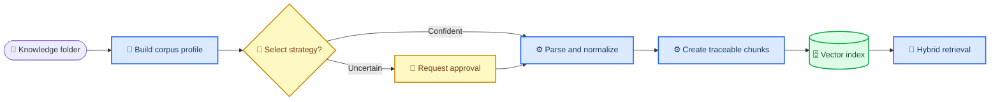

# Knowledge Agent 与 RAG 策略设计

**状态：** 已确认（方案 B）
**分支：** `dev/knowledge`
**范围：** 文档化设计与单份 Markdown 测试知识库；不修改应用代码。

---

## 📝 目标与边界

本设计为 Orbit 的知识库增加一个 **Knowledge Agent**：它先对 `knowledge/` 文件夹中的语料生成可审计的画像，再从受控策略目录中选择解析、切块、嵌入与检索配置，最后把带版本和来源的块写入向量数据库。

本次交付只提供设计和测试语料：[企业运营知识库测试集](../../../knowledge/企业运营知识库测试集.md)。后续实现应支持 PDF、DOCX、XLSX、Markdown 与 TXT；当前 `dev/optimize` 只实际支持 PDF、Markdown、TXT，因此不能把本设计中的多格式能力误认为已上线。

不在本范围内：自动执行重建索引、接入外部对象存储、选择或调用付费 OCR/LLM 服务、变更租户或权限模型。

## 🎯 成功标准

- 每次导入都产生一份语料画像、一次策略决策和一个可定位的索引版本。
- 策略只能从受控目录中选取；任何高成本或低置信度决策都需要人工确认。
- 每个向量块可追溯到原文件、页码或工作表、块序号、解析器和策略版本。
- 查询可同时利用语义相似性、关键词和元数据过滤，并返回可读引用。
- 测试语料可验证制度问答、产品参数、版本优先级、表格记录与术语检索。

## 🔍 现状与设计依据

`dev/optimize` 的 `backend/app/ingest` 仅注册 `.pdf`、`.md`、`.txt`；`backend/app/chunk` 以段落和字符数切分；`backend/app/search` 仅调用 Chroma 向量查询。因此当前最小路径可以导入本次 Markdown 测试语料，但尚不能完成 Word/Excel 解析、文档级策略路由或混合检索。

多格式知识库应将解析、切块和向量化视为独立阶段，并保留原文映射；主流托管知识库也将 DOC/DOCX、XLS/XLSX、PDF、Markdown、TXT 列为可摄取来源。[^1] 对结构复杂或长文档，分层或语义切块可以在召回精度与上下文完整性之间取舍；语义切块通常成本更高。[^2] 在查询侧，关键词和向量的混合检索可提升专有名词、编号和语义表达并存时的召回。[^3]

## ⚙️ 目标架构



### 组件职责

| 组件 | 输入 | 输出 | 责任 |
| --- | --- | --- | --- |
| 扫描器 | `knowledge/` 中的文件 | 文件清单、哈希、MIME、大小 | 发现新增、变更和删除，避免无意义重建。 |
| 画像器 | 文件清单与抽样文本 | `CorpusProfile` | 识别格式、语言、标题、页码、表格、扫描件信号和敏感字段标签。 |
| 策略路由器 | 画像与策略目录 | `StrategyDecision` | 用确定性规则优先、受限模型建议兜底的方式选择策略。 |
| 解析与规范化器 | 原文件、策略 | 可引用的规范文本/记录 | 保留源定位：页、标题路径、工作表、行区间。 |
| 切块与索引器 | 规范内容、策略 | 块、嵌入、索引版本 | 生成稳定块 ID，并使索引版本可回滚。 |
| 检索器 | 查询、过滤条件 | 排序块和引用 | 执行关键词+向量召回、融合、可选重排与来源展示。 |

## 🧠 策略目录与选择规则

Knowledge Agent 不直接生成任意参数，而是从以下版本化目录中选择。`strategy_id` 和参数快照必须随导入记录保存。

| 策略 ID | 适用画像 | 解析方式 | 切块方式 | 检索偏好 |
| --- | --- | --- | --- | --- |
| `markdown_structured_v1` | Markdown/TXT，标题和段落明显 | 保留标题路径 | 标题优先，约 400–700 tokens，10% 重叠 | 混合检索，标题加权 |
| `pdf_text_hierarchical_v1` | 有可提取文本的 PDF | 页码+标题 | 子块 300–500 tokens，父块保留章节 | 混合检索，返回父块上下文 |
| `pdf_ocr_review_v1` | 扫描 PDF 或文本提取率低 | OCR 候选，人工确认 | 页面边界优先 | 混合检索，标记 OCR 置信度 |
| `docx_heading_v1` | Word 标题层级可用 | 段落、标题、表格 | 标题+表格边界 | 混合检索，标题加权 |
| `xlsx_record_v1` | Excel 表头稳定 | 工作表、表头、行记录 | 一行或逻辑记录组 | 关键词字段过滤+向量检索 |

选择顺序如下：

1. 根据扩展名、MIME 和解析可行性筛掉不兼容策略。
2. 根据结构信号选择最保守且可复现的策略；例如有标题的 Markdown 选 `markdown_structured_v1`。
3. 若扫描件、合并单元格、多语言混杂或置信度低于阈值，产出 `needs_review`，不自动写入正式索引。
4. 仅在人工批准后执行昂贵策略，例如 OCR 或全库语义切块。

## 🗃️ 记录模型与可追溯性

### 导入记录

```json
{
  "ingestion_run_id": "ing_20260801_001",
  "corpus_id": "ops-demo",
  "corpus_fingerprint": "sha256:...",
  "strategy_id": "markdown_structured_v1",
  "strategy_version": "1.0.0",
  "decision_source": "rule",
  "confidence": 0.94,
  "status": "indexed"
}
```

### 块元数据

每个块至少保存 `chunk_id`、`document_id`、`source_path`、`source_hash`、`source_type`、`section_path`、`page_number`（如有）、`sheet_name` 和 `row_range`（如有）、`chunk_index`、`parser_version`、`strategy_id`、`embedding_model`、`index_version`、`created_at`。任何不存在的定位字段应为 `null`，不可用猜测值填充。

原始文本、规范化文本与嵌入文本应分开保存或可由哈希关联：前两者用于引用和审计，最后者仅用于检索。索引更新按 `source_hash` 增量处理；同一源内容重试必须生成相同块 ID，删除文件则将对应块标为失效并从活动索引移除。

## 🔎 检索与引用策略

查询处理遵循以下顺序：

1. 使用元数据过滤范围，例如租户、知识库、文件类型、生效版本和权限。
2. 并行执行关键词检索与向量检索，融合候选结果。
3. 对候选做轻量重排；高风险答案要求至少两条可追溯依据，或明确回答“资料不足”。
4. 返回答案时展示原文件、章节/页码或工作表/行区间、版本和导入时间。

对于本次测试语料，`2026-Q3` 生效规则优先于标注为“已废止”的历史规则；检索器应在最终答案中说明采用的版本，而不是拼接相互冲突的内容。

## 🛡️ 错误处理与治理

| 情况 | 系统动作 | 人工动作 |
| --- | --- | --- |
| 不支持的格式 | 记录为 `unsupported`，不入库 | 选择新增解析器或转码。 |
| PDF 无可提取文本 | 记录 `needs_review`，不伪造内容 | 批准 OCR 或补充可搜索源。 |
| Excel 表头不稳定 | 记录抽样与低置信度 | 指定表头、主键和记录粒度。 |
| 策略改变 | 创建新 `index_version`，保留旧版本 | 验收后切换活动版本，必要时回滚。 |
| 检索证据不足 | 返回“不足以回答”及最接近引用 | 补充资料或调整策略。 |

任何导入日志、策略原因和访问控制信息都按现有租户边界保存。策略路由器不得把文件正文发送给未被批准的外部服务；如未来启用外部 OCR 或模型，必须在配置中显式声明数据边界。

## ✅ 验收与后续实施

本次文档验收：

- [x] 分支从 `dev/optimize` 创建为 `dev/knowledge`。
- [x] 提供一份可导入的 Markdown 测试知识库。
- [x] 定义了策略目录、决策记录、块元数据、索引版本和异常处理。
- [x] 明确了当前实现与目标能力之间的边界。

后续代码实施应拆成独立计划：先补充 DOCX/XLSX 解析与导入记录，再引入策略路由和版本化块元数据，最后接入混合检索与评估集。每一阶段都应以本次测试知识库中的可验证问题作为回归样例。

## 🔗 参考资料

[^1]: Amazon Bedrock. “Prerequisites for your Amazon Bedrock knowledge base data.” https://docs.aws.amazon.com/bedrock/latest/userguide/knowledge-base-ds.html
[^2]: Amazon Bedrock. “How content chunking works for knowledge bases.” https://docs.aws.amazon.com/bedrock/latest/userguide/kb-chunking.html
[^3]: Microsoft Learn. “Retrieval-augmented generation (RAG) in Azure AI Search.” https://learn.microsoft.com/en-us/azure/search/retrieval-augmented-generation-overview
