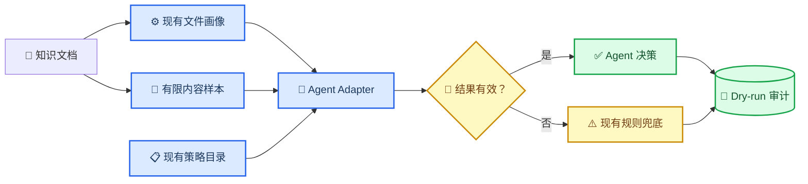

# Knowledge Agent Adapter 第二阶段设计规范

_Orbit `dev/knowledge` 延续性设计，2026-08-02_

---

## 🎯 目标与范围

第二阶段在第一阶段 dry-run 流程上接入真实的 OpenAI-compatible Knowledge Agent，并为每份测试文档补齐期望标签。本阶段仍然只生成计划：不得创建切片、嵌入、集合或向量记录。

验收目标：

- 每份测试文档都有明确的期望策略和人工复核标签
- Agent 读取有限长度的内容样本和现有 `CorpusProfile`
- Agent 只能从现有策略目录中选择策略
- 输出非法、缺少密钥、请求失败或策略不兼容时，按文件独立回退
- 现有传入 `agent_suggestions` 的调用方式保持兼容
- 现有 `FolderPlan` 继续作为后续“批准后入库”的唯一交接对象

本阶段不包含：

- 将计划写入向量数据库
- 执行 OCR、切片、嵌入、检索或生成质量评测
- 多轮工具编排或建立第二套策略实现

## 🧭 与第一阶段的连续性

| 第一阶段组件 | 第二阶段扩展方式 |
| --- | --- |
| `CorpusProfile` | 继续作为确定性的结构化输入 |
| `STRATEGY_CATALOG` | 继续作为唯一可选策略来源 |
| `select_strategy(profile, suggestion)` | 继续作为最终校验和兜底入口 |
| `plan_folder()` | 增加可选 Adapter，同时保持 dry-run 保证 |
| `FolderPlan` | 增加可选 Agent 追踪信息，不修改现有必填字段 |
| SQLite 审计仓储 | 保存最终决策，并以增量字段保存 Agent 追踪信息 |
| `POST /api/knowledge/plan-folder` | 增加默认值为 `true` 的 `use_agent` 参数 |
| `questions.jsonl` | 继续作为后续检索评测问题集 |

不得建立平行的处理流程、策略目录或计划模型。

## 🏗️ 系统架构



### 期望标签数据集

新增 `knowledge/evals/expected-strategies.jsonl`，每份测试文档对应一行：

```json
{"source":"clean-policy.md","expected_strategy_id":"markdown_hierarchical_v1","requires_review":false,"rationale":"Markdown 标题结构稳定","expected_signals":["heading_count"]}
```

七份测试文档的期望标签如下：

| 测试文档 | 期望策略 | 需要复核 |
| --- | --- | --- |
| `clean-policy.md` | `markdown_hierarchical_v1` | 否 |
| `clean-handbook.docx` | `docx_layout_aware_v1` | 否 |
| `messy-notes.docx` | `docx_layout_aware_v1` | 是 |
| `text-report.pdf` | `pdf_text_hierarchical_v1` | 否 |
| `scanned-notice.pdf` | `pdf_ocr_review_v1` | 是 |
| `clean-projects.xlsx` | `spreadsheet_structured_v1` | 否 |
| `messy-operations.xlsx` | `spreadsheet_structured_v1` | 是 |

`requires_review=true` 表示升级复核要求。Agent 可以增加人工复核，但不能取消策略目录或确定性规则要求的复核。

### 文档证据提取

独立的证据读取器从每份文件中最多提取 6,000 个字符：

- Markdown 和纯文本：解码后的正文
- DOCX：段落文字与表格单元格
- XLSX：工作表名称与非空单元格值
- 文本型 PDF：逐页提取的文本
- 扫描型 PDF：空文本样本与结构画像

内容样本只在模型请求期间驻留内存，不进入计划响应或审计数据库，避免重复保存原始文档内容。

### Adapter 协议

`OpenAICompatibleKnowledgeAgent` 复用现有环境变量：

| 环境变量 | 是否必需 | 默认值 | 用途 |
| --- | --- | --- | --- |
| `LLM_API_KEY` | Agent 调用时必需 | 空 | Bearer 凭据 |
| `LLM_BASE_URL` | 否 | OpenAI Chat Completions 地址 | 兼容接口地址 |
| `LLM_MODEL` | 否 | `gpt-4o-mini` | 规划模型 |
| `KNOWLEDGE_AGENT_TIMEOUT_SECONDS` | 否 | `20` | 单文件请求超时 |

请求使用温度 `0` 和 JSON Object 响应模式。模型必须返回：

```json
{
  "strategy_id": "pdf_text_hierarchical_v1",
  "confidence": 0.91,
  "reason": "PDF 文本提取可靠，页面结构稳定。",
  "requires_review": false
}
```

Adapter 返回带类型的调用结果，其中包含状态、模型、耗时、策略建议和脱敏错误分类。模型错误或网络错误不得中断整个文件夹的处理循环。

## 🛡️ 校验与失败处理

现有选择器保持最终裁决权。第二阶段只扩展一项行为：合法的布尔值 `requires_review` 可以升级人工复核，但策略目录要求的复核不能被取消。

| 条件 | 处理结果 |
| --- | --- |
| Agent 被禁用 | 使用现有规则兜底 |
| 缺少 API Key | 使用现有规则兜底，追踪状态为 `unavailable` |
| 超时或 HTTP 错误 | 仅当前文件使用规则兜底 |
| JSON 非法或字段缺失 | 仅当前文件使用规则兜底 |
| 策略未知或不兼容 | 仅当前文件使用规则兜底 |
| 策略合法且兼容 | 接受 Agent 决策 |
| Agent 要求人工复核 | 启用人工复核 |
| Agent 尝试取消强制复核 | 仍保持人工复核 |

API 接受 `use_agent: true|false`。为保持测试和现有调用兼容，继续支持显式传入 `agent_suggestions`；如果某份文件已有显式建议，该建议优先于外部 Adapter 调用。

## 🧪 测试与验收

实现过程遵循 red-green-refactor 循环。

必须覆盖以下测试：

- 期望标签文件恰好覆盖七份测试文档，并且所有策略都存在于策略目录
- 内容证据有长度上限，并支持所有测试文件类型
- 合法的 OpenAI-compatible 响应能够转换为带类型的策略建议
- 缺少密钥、超时、非法 JSON 和不兼容策略不会中断文件夹处理，并触发规则兜底
- 人工复核可以升级，强制复核不能被取消
- `use_agent=false` 时不发起 HTTP 请求
- API 始终返回 `dry_run=true` 和 `vector_store_writes=0`
- 第一阶段的全部 Knowledge Agent 测试继续通过

验收时必须运行完整的 Knowledge Agent 测试集，并确认 Git 暂存区不包含已有的无关文档变更和本地 `.pydeps` 目录。

## 📦 交付边界

实现提交到 `dev/knowledge` 并推送至现有 PR。期望标签数据集、Adapter、证据读取器、流水线集成、增量审计追踪、API 开关、测试和简要配置文档共同组成一个连续的第二阶段增量。
