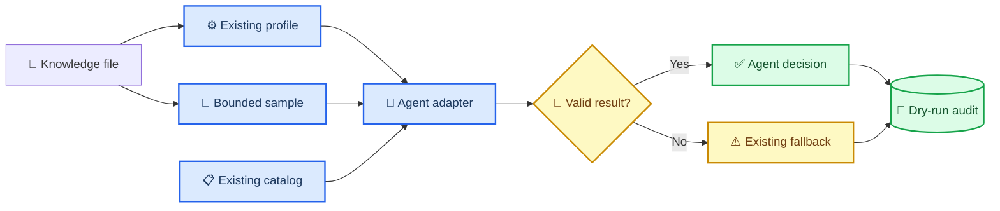

# Knowledge Agent Adapter phase-two design

_Orbit `dev/knowledge` continuation design, 2026-08-02_

---

## 🎯 Goal and scope

Phase two connects a real OpenAI-compatible Knowledge Agent to the phase-one dry-run pipeline and adds expected labels for every generated fixture. The feature remains a planner: it must not create chunks, embeddings, collections, or vector records.

Success means:

- Every fixture has an explicit expected strategy and review label
- The Agent reads a bounded content sample plus the existing `CorpusProfile`
- The Agent can select only entries from the existing strategy catalog
- Invalid output, missing credentials, transport errors, and incompatible choices fall back per file
- Existing callers that provide `agent_suggestions` continue to work
- The existing `FolderPlan` remains the single hand-off object for later approved ingestion

Out of scope:

- Writing plans into the vector database
- Executing OCR, chunking, embedding, retrieval, or generation evaluation
- Multi-turn tool orchestration or a second strategy implementation

## 🧭 Continuity with phase one

| Phase-one component | Phase-two extension |
| --- | --- |
| `CorpusProfile` | Remains the deterministic structural input |
| `STRATEGY_CATALOG` | Remains the only allowed strategy source |
| `select_strategy(profile, suggestion)` | Remains the final validation and fallback gate |
| `plan_folder()` | Gains an optional Adapter without changing its dry-run guarantee |
| `FolderPlan` | Gains optional Agent trace data without changing existing required fields |
| SQLite audit repository | Stores the final decision and an additive Agent trace |
| `POST /api/knowledge/plan-folder` | Gains `use_agent`, defaulting to `true` |
| `questions.jsonl` | Remains the later retrieval-evaluation question set |

No parallel pipeline, strategy catalog, or alternate plan model will be introduced.

## 🏗️ Architecture



### Expected-label dataset

Create `knowledge/evals/expected-strategies.jsonl` with one row per fixture:

```json
{"source":"clean-policy.md","expected_strategy_id":"markdown_hierarchical_v1","requires_review":false,"rationale":"Stable Markdown headings","expected_signals":["heading_count"]}
```

The seven fixture labels are:

| Fixture | Expected strategy | Review |
| --- | --- | --- |
| `clean-policy.md` | `markdown_hierarchical_v1` | No |
| `clean-handbook.docx` | `docx_layout_aware_v1` | No |
| `messy-notes.docx` | `docx_layout_aware_v1` | Yes |
| `text-report.pdf` | `pdf_text_hierarchical_v1` | No |
| `scanned-notice.pdf` | `pdf_ocr_review_v1` | Yes |
| `clean-projects.xlsx` | `spreadsheet_structured_v1` | No |
| `messy-operations.xlsx` | `spreadsheet_structured_v1` | Yes |

`requires_review=true` is an escalation. An Agent may request extra review, but it may never remove review required by the catalog or deterministic rules.

### Document evidence

A focused evidence reader extracts at most 6,000 characters from each file:

- Markdown and text: decoded text
- DOCX: paragraph text and table cells
- XLSX: worksheet names and non-empty cell values
- Text PDF: extracted page text
- Scanned PDF: an empty text sample plus the structural profile

The sample is used only in memory for the model request. It is not added to the plan response or audit database, preventing accidental duplication of document content.

### Adapter contract

`OpenAICompatibleKnowledgeAgent` uses existing environment variables:

| Variable | Required | Default | Purpose |
| --- | --- | --- | --- |
| `LLM_API_KEY` | Yes for Agent calls | Empty | Bearer credential |
| `LLM_BASE_URL` | No | OpenAI chat completions URL | Compatible endpoint |
| `LLM_MODEL` | No | `gpt-4o-mini` | Planning model |
| `KNOWLEDGE_AGENT_TIMEOUT_SECONDS` | No | `20` | Per-file timeout |

The request uses temperature `0` and JSON-object response mode. The model must return:

```json
{
  "strategy_id": "pdf_text_hierarchical_v1",
  "confidence": 0.91,
  "reason": "The PDF has reliable extractable text and stable page structure.",
  "requires_review": false
}
```

The Adapter returns a typed attempt containing status, model, duration, suggestion, and a sanitized error category. It never raises a model or network exception into the folder loop.

## 🛡️ Validation and failure behavior

The existing selector remains authoritative. Phase two extends it so a valid boolean `requires_review` may escalate review while catalog-required review cannot be suppressed.

| Condition | Result |
| --- | --- |
| Agent disabled | Existing rule fallback |
| Missing API key | Existing rule fallback; trace status `unavailable` |
| Timeout or HTTP failure | Existing rule fallback for that file only |
| Invalid JSON or missing fields | Existing rule fallback for that file only |
| Unknown or incompatible strategy | Existing rule fallback for that file only |
| Valid compatible strategy | Agent decision accepted |
| Agent requests review | Review is enabled |
| Agent tries to suppress required review | Required review remains enabled |

The API accepts `use_agent: true|false`. Explicit `agent_suggestions` remain supported for tests and compatibility; when a suggestion is supplied for a file, it takes precedence over an external Adapter call for that file.

## 🧪 Testing and acceptance

Implementation follows red-green-refactor cycles.

Required tests:

- The expected-label file covers exactly all seven fixtures and references valid catalog strategies
- Evidence extraction is bounded and handles every fixture type
- A successful OpenAI-compatible response becomes a typed suggestion
- Missing credentials, timeout, malformed JSON, and incompatible strategies fall back without aborting the folder
- Review escalation works and required review cannot be suppressed
- `use_agent=false` performs no HTTP request
- The API still returns `dry_run=true` and `vector_store_writes=0`
- All phase-one Knowledge Agent tests remain green

Acceptance requires the complete Knowledge Agent test suite to pass and Git staging to exclude the pre-existing unrelated document changes and local `.pydeps` directory.

## 📦 Delivery boundary

The implementation will be committed on `dev/knowledge` and pushed to the existing PR. The expected-label dataset, Adapter, evidence reader, pipeline integration, additive audit trace, API flag, tests, and concise configuration documentation form one coherent phase-two increment.
