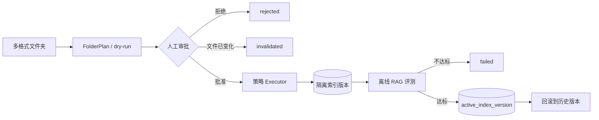

# Knowledge Agent 第三阶段设计规范：审批式入库闭环

_Orbit `dev/knowledge` 连续演进设计，2026-08-05_

---

## 目标

第三阶段把第二阶段产生的 `FolderPlan` 变成可审批、可执行、可评测、可发布和可回滚的 `KnowledgeRun`。系统仍以第二阶段的文件画像、策略目录、Agent 建议校验和规则兜底为唯一规划入口，不建立第二条 Knowledge Agent 流水线。

本阶段分为四个可独立验收的子阶段：

1. **3.1 运行与审批**：持久化运行状态，校验审批时文件未变化。
2. **3.2 策略执行**：按策略生成带来源定位的确定性 Chunk，写入隔离索引。
3. **3.3 评测与发布**：运行离线检索评测，通过门禁后发布，可回滚。
4. **3.4 工作台 UI**：展示策略差异、审批、执行轨迹、评测报告和版本切换。

本规范禁止将旧 `/api/knowledge/upload` 直接写库流程复制到 Knowledge Agent 内部。第三阶段完成后，知识文件的正式入库必须收敛到 `KnowledgeRun`。

## 连续架构



## 运行状态模型

`KnowledgeRun` 使用以下状态：

| 状态 | 含义 |
| --- | --- |
| `planned` | 计划已生成，没有策略强制复核项，但仍未获准入库 |
| `review_required` | 至少一份文档要求人工复核 |
| `approved` | 人工已批准，且审批时源文件哈希与计划一致 |
| `indexing` | 正在生成 Chunk 并写入隔离索引 |
| `evaluating` | 隔离索引已完成，正在执行评测 |
| `promoted` | 评测通过，索引版本已发布 |
| `rejected` | 人工拒绝该计划 |
| `failed` | 执行或评测失败 |
| `rolled_back` | 已发布版本被回滚 |
| `invalidated` | 文件在计划后发生变化，计划失效 |

允许的状态转换必须由代码中的白名单控制，API 不得直接写任意状态：

```text
planned         -> approved | rejected | invalidated
review_required -> approved | rejected | invalidated
approved        -> indexing | invalidated
indexing        -> evaluating | failed
evaluating      -> promoted | failed
promoted        -> rolled_back
```

终态不能继续转换。并发转换使用数据库条件更新，避免同一运行被重复批准或执行。

## 3.1 运行与审批

`FolderPlan` 新增 `folder_path` 和 `status`。`status` 由最终文档决策确定：任一文档 `requires_review=true` 时为 `review_required`，否则为 `planned`。

审批前必须重新扫描计划目录，并比较完整文件清单与每个 `source_hash`：

- 文件新增、删除、重命名或内容变化：将运行标记为 `invalidated`，拒绝审批。
- 文件清单与哈希一致：原子转换为 `approved`，记录审批时间。
- 运行不属于当前用户：按不存在处理，避免泄漏跨租户信息。
- 已批准或终态运行再次批准：返回状态冲突，不重复写入。

本子阶段仍保持 `vector_store_writes=0`，不导入 `app.store`、Embedding 或 ChromaDB。

## 3.2 策略执行

策略目录从声明升级为声明与 Executor 注册表。所有 Executor 输出统一的 `KnowledgeChunk`：

```text
chunk_id, text, source_path, source_hash, strategy_id, run_id,
chunk_index, page, sheet, heading_path, metadata
```

`chunk_id` 必须由稳定输入生成，以支持幂等重试。Markdown、DOCX、XLSX、文本 PDF 和扫描 PDF 分别实现独立 Executor；扫描 PDF 的 OCR 不可用时必须显式失败或进入复核，不能静默生成空 Chunk。

执行只写入以 `run_id` 隔离的 staging collection，不修改当前活动索引。

## 3.3 评测、发布与回滚

使用 `knowledge/evals/questions.jsonl` 运行第一版确定性检索评测，至少记录：

- 期望来源 Hit@5
- Locator 命中情况
- 空 Chunk 数
- 重复 Chunk 数
- 每份文件 Chunk 数
- 索引和检索耗时

只有评测门禁通过的运行可进入 `promoted`。发布通过更新知识空间的活动索引指针完成，不复制向量。回滚只允许切换到已存在且完整的历史索引版本。

## 3.4 Knowledge Workbench

前端围绕 `KnowledgeRun` 提供四个视图：运行列表、策略审阅、执行时间线、评测与版本。用户必须能看到 Agent 建议、规则兜底、文件画像、置信度、复核原因和来源定位，并在批准前确认计划差异。

## 安全与审计约束

- 未批准运行不得写向量库。
- 原始内容样本不进入审计数据库。
- API Key、Authorization Header 和完整异常正文不得进入运行记录。
- 所有改变索引状态的动作记录操作者、时间、前后状态和失败分类。
- 用户只能读取和操作自己的运行。
- 旧上传接口在迁移完成前保留兼容，但不得被新工作台调用。

## 第三阶段验收标准

- 非法状态转换被拒绝，并发审批至多成功一次。
- 审批后源文件发生任何变化都会使计划失效。
- 五类策略拥有真实 Executor，重复执行不产生重复 Chunk。
- 单文档失败不污染活动索引。
- 现有五个问题的期望来源全部进入 Top 5。
- 评测失败不能发布，已发布版本可以回滚。
- 前端能完成计划、审批、执行、评测、发布和回滚流程。
- 每个子阶段均保持既有 Knowledge Agent 回归测试通过。

