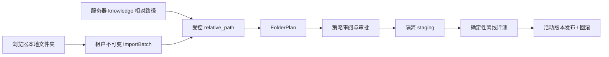

# Knowledge Workbench 3.4 中文设计规范

_Orbit `dev/knowledge` 连续演进设计，2026-08-11_

## 1. 目标与范围

3.4 将 3.1—3.3 已完成的 Knowledge Agent 后端能力接入可实际操作、可恢复、可审计的前端向导。用户可以从服务器知识目录或本地文件夹创建知识批次，依次完成规划、策略审阅、审批、隔离索引、离线评测、发布和回滚。

本阶段不建立第二条 RAG 流水线。两种知识来源都必须转换成 `knowledge/` 下受控的相对路径，再复用同一个 `plan-folder → approve → execute → evaluate → promote/rollback` 流程。

为控制交付风险，3.4 分成两个连续子阶段：

1. **3.4.1 服务器目录工作台**：先让现有 `knowledge/fixtures` 等服务器目录跑通全部向导步骤。
2. **3.4.2 本地文件夹安全导入**：增加租户隔离、不可变的目录导入批次，导入成功后进入同一向导。

两个子阶段共享组件、状态机、API 类型和测试，不允许复制页面或业务状态。

## 2. 设计原则

- **单一流水线**：上传来源不同，规划、执行、评测和发布逻辑相同。
- **后端状态为准**：前端根据 Run 和活动版本计算可执行动作，不自行推进状态。
- **显式危险动作**：审批、发布和回滚都需要明确确认，不通过自动重试改变索引状态。
- **过程透明**：用户能看到 Agent 建议、规则兜底、最终策略、复核原因、评测指标和版本切换结果。
- **可恢复**：刷新或重新打开页面后，通过 Run ID 和运行列表恢复，而不是依赖 React 内存。
- **固定安全策略**：collection 名称、评测阈值、租户路径和 Run 状态不接受前端覆盖。
- **兼容但不扩散**：旧单文件上传保留在折叠的兼容区，新工作台不调用它完成正式入库。

## 3. 总体架构

前端采用模块化向导和显式状态归约器。向导包含七步：

```text
1 选择来源
    ↓
2 导入或确认服务器路径
    ↓
3 生成 FolderPlan
    ↓
4 审阅文件画像与 RAG 策略
    ↓
5 审批并执行 staging
    ↓
6 查看离线评测报告
    ↓
7 发布活动版本或回滚
```

`KnowledgeWorkbench` 只负责页面布局和步骤编排；领域判断由纯函数状态归约器完成；API 请求集中在强类型客户端；每一步使用独立组件。组件不得直接拼接租户目录、collection 名称或状态转换。

本地文件夹导入成功后返回服务器生成的 `relative_path`，此后与服务器目录来源完全一致：



## 4. 页面布局

桌面端使用三段式布局：

- 顶部：七步进度条、当前来源和全局状态。
- 中部：当前步骤的主要任务区。
- 右侧：始终可见的 Run 摘要和下一动作。

窄屏时右侧摘要折叠到步骤内容上方，主任务区保持单列。沿用 Orbit 现有深色设计令牌、圆角、边框和状态色，不复制 Codex 或 Workbuddy 的视觉皮肤，只借鉴任务聚焦、过程透明、状态恢复和危险动作确认。

### 4.1 步骤内容

| 步骤 | 主要内容 | 继续条件 |
| --- | --- | --- |
| 选择来源 | 服务器目录、本地文件夹两张选择卡 | 已选择一种来源 |
| 导入 | 路径输入或文件清单、格式分布、大小、上传进度 | 服务器路径有效，或导入批次已冻结 |
| 规划 | 是否启用 Agent、创建 dry-run | FolderPlan 创建成功 |
| 审阅 | 文件画像、Agent 建议、最终策略、置信度、兜底和复核原因 | 用户完成审阅 |
| 执行 | 审批确认、staging 写入进度、Chunk 和写入计数 | Run 进入 `evaluating` |
| 评测 | 总门禁、四项指标、失败原因、逐问题命中 | 报告为 `passed` 才可发布 |
| 发布 | 当前、候选和上一版本；发布或回滚确认 | 后端返回新的活动版本 |

强制复核文件在审阅步骤默认展开。评测 `rejected`、执行 `failed` 或源文件 `invalidated` 时保留审计信息，并提供“从来源重新规划”，不允许在原 Run 上跳过失败状态。

### 4.2 右侧运行摘要

摘要展示：

- Run ID、来源和当前状态；
- 文件数、策略数、强制复核数；
- staging collection 是否为当前活动版本；
- Chunk 数和向量写入数；
- 最近脱敏错误分类；
- 根据服务端状态计算的下一项可执行动作。

## 5. 前端领域模型与状态

TypeScript 客户端为以下对象提供明确类型：

- `ImportBatch`、`ImportFileRecord`；
- `FolderPlan`、`PlannedDocument`、`CorpusProfile`、`StrategyDecision`、`AgentAttempt`；
- `KnowledgeRun`；
- `EvaluationReport`、`EvaluationCaseResult`；
- `ActiveIndexVersion`。

向导状态至少包含：

```text
sourceMode, serverPath, importBatch,
plan, run, evaluation, activeVersion,
currentStep, pendingAction, error
```

`deriveWorkbenchState()` 根据这些服务端对象计算当前步骤、可用动作和只读状态。组件不能通过 `setCurrentStep()` 绕过领域状态；用户只能在已完成步骤之间回看。

Run 状态对应动作：

| Run 状态 | 工作台动作 |
| --- | --- |
| `planned` / `review_required` | 审阅并审批 |
| `approved` | 执行隔离索引 |
| `indexing` | 禁止重复执行，刷新或轮询 |
| `evaluating` | 启动评测或读取既有报告 |
| `rejected` / `failed` / `invalidated` | 只读失败信息，从来源创建新 Run |
| `promoted` | 展示活动版本和回滚入口 |
| `rolled_back` | 只读历史记录 |

活动版本最终以 `GET /api/knowledge/active-version` 为准，不能只根据 Run 的 `promoted` 状态推断。

## 6. 本地文件夹导入

### 6.1 数据模型

导入批次状态为：

```text
uploading → validating → ready
        ↘ failed
uploading / failed → deleted
```

每个批次保存 `import_id`、`user_id`、状态、文件数量、总大小、文件清单哈希、创建/冻结时间和稳定错误分类。单文件记录保存规范化相对路径、大小、SHA-256 和上传状态，不把文件正文写入 SQLite。

运行时目录分为临时和冻结两类：

```text
knowledge/imports/.staging/<tenant-hash>/<import-id>/
knowledge/imports/ready/<tenant-hash>/<import-id>/
```

`complete` 校验成功后使用同一文件系统内的原子改名冻结目录。冻结后不能新增、覆盖或删除单个文件。

### 6.2 API

| 端点 | 方法 | 作用 |
| --- | --- | --- |
| `/api/knowledge/imports` | POST | 创建当前租户的导入批次 |
| `/api/knowledge/imports/{import_id}/files` | POST | 上传一个带规范化相对路径的文件 |
| `/api/knowledge/imports/{import_id}/complete` | POST | 校验并冻结批次，返回 `relative_path` |
| `/api/knowledge/imports/{import_id}` | GET | 查询批次和逐文件进度 |
| `/api/knowledge/imports/{import_id}` | DELETE | 删除未被 Run 引用的非活动批次 |
| `/api/knowledge/runs` | GET | 查询当前租户最近的 Run 以恢复工作台 |

所有端点强制登录。`import_id` 由服务端生成，前端不能提供用户目录或绝对路径。

### 6.3 安全限制

- 拒绝绝对路径、盘符、空路径、`.`、`..`、反斜杠逃逸、NUL 字符、符号链接和规范化后的重复路径。
- 第一版只允许 `.md`、`.docx`、`.xlsx` 和 `.pdf`，与策略 Executor 保持一致。
- 单文件最大 25 MiB、单批次最大 250 MiB、单批次最多 500 个文件；限制由后端常量控制。
- 上传采用流式写入临时文件，同时计算 SHA-256；超过限制立即停止并删除该临时文件。
- 同一路径重复上传返回冲突，不覆盖已有文件。
- 只有全部文件上传成功且清单非空时才能冻结。
- 批次被 KnowledgeRun 引用后不可删除；当前活动版本或可回滚上一版本引用的批次也不可删除。
- 所有路径错误、大小错误和存储错误只返回稳定分类，不暴露服务器绝对路径。

## 7. 运行恢复与历史列表

`GET /api/knowledge/runs` 默认返回当前用户最近 20 条 Run，按创建时间倒序，支持基于 `(created_at, run_id)` 的游标分页，不接受任意 user ID。响应只包含运行摘要，不包含文档正文或 Agent 证据样本。

工作台把最近选择的 Run ID 保存在本地。打开页面时：

1. 获取最近运行和活动版本；
2. 若本地 Run ID 仍属于当前用户，则加载它；
3. 否则加载最近一条 Run；
4. 没有 Run 时进入来源选择；
5. 网络失败时保留 Run ID，显示重试，不清空已有页面数据。

## 8. 错误处理与并发

错误分为：

- **表单错误**：路径为空、类型不支持、文件超限，就地显示；
- **导入错误**：逐文件显示稳定分类，失败批次不能规划；
- **状态冲突**：收到 409 后重新加载 Run 和活动版本，再计算动作；
- **基础设施错误**：保留步骤、Run ID 和已成功结果，允许稍后继续；
- **鉴权错误**：401 清除无效会话并引导登录，不展示其他租户是否存在对应资源。

审批、执行、评测、发布和回滚按钮在请求期间禁用。服务端仍通过状态条件更新和事务保证并发安全，前端禁用按钮不是一致性边界。

## 9. 测试策略

### 9.1 后端

使用 pytest 按 TDD 覆盖：

- 路径穿越、绝对路径、重复规范化路径和跨租户访问；
- 文件数量、单文件大小、批次大小和类型限制；
- 上传失败清理、冻结原子性和冻结后禁止写入；
- Run 引用后的删除保护；
- 最近运行列表的租户隔离、排序和游标分页；
- 导入批次返回的 `relative_path` 能进入现有规划、审批和执行流程。

### 9.2 前端

引入 Vitest、Testing Library 和 jsdom，按 TDD 覆盖：

- `deriveWorkbenchState()` 对每个 Run 状态计算正确步骤和动作；
- API 客户端的请求路径、认证和错误分类；
- 服务器目录完整成功流；
- 本地目录导入、逐文件失败和冻结成功流；
- `review_required` 默认展开、`rejected` 禁止发布、409 后刷新；
- 发布确认、活动版本刷新和回滚目标缺失；
- 刷新后根据 Run ID 恢复。

网络层使用可注入 API 对象或 MSW 隔离，不在组件测试里访问真实后端。

### 9.3 验收

- 前端 lint、TypeScript 类型检查、单元测试和生产构建通过；
- Knowledge 后端全量回归通过；
- 使用 Playwright 打开本地应用，实际完成一次服务器目录流程和一次本地文件夹导入流程；
- 保存来源选择、策略审阅、评测报告和发布结果四张关键截图；
- 验证窄屏布局、键盘焦点、禁用状态、错误提示和减少动画偏好。

## 10. 文件边界

计划中的前端职责边界：

```text
frontend/src/components/knowledge-workbench/
├── knowledge-workbench.tsx       # 页面布局与数据装配
├── workbench-reducer.ts          # 纯状态归约和动作推导
├── workbench-types.ts            # 前端领域类型
├── workbench-summary.tsx         # 右侧摘要
└── steps/
    ├── source-step.tsx
    ├── import-step.tsx
    ├── planning-step.tsx
    ├── review-step.tsx
    ├── execution-step.tsx
    ├── evaluation-step.tsx
    └── release-step.tsx
```

`frontend/src/lib/knowledge-api.ts` 只负责强类型 HTTP 契约；旧 `frontend/src/lib/api.ts` 的聊天、搜索和兼容上传保持可用。现有 `KnowledgeBasePanel` 改为渲染新工作台，并在次要位置保留兼容上传。

后端按导入模型、仓储、服务和 API 分离，避免继续扩大 `knowledge_plan.py`：

```text
backend/app/knowledge_agent/import_models.py
backend/app/knowledge_agent/import_repository.py
backend/app/knowledge_agent/imports.py
backend/app/api/knowledge_imports.py
```

运行列表查询继续放在 Knowledge Agent repository，API 入口保持在现有受认证 Knowledge 路由下。

## 11. 完成标准

- 登录用户能使用服务器目录完成七步向导。
- 登录用户能导入本地多格式文件夹，并进入同一条七步向导。
- 工作台完整展示画像、Agent 建议、规则兜底、最终策略、评测门禁和活动版本。
- 评测未通过不能发布，回滚目标缺失不能改变活动指针。
- 刷新页面能够恢复最近 Run，跨租户资源不可见。
- 本地导入不会发生路径逃逸、同名覆盖、超限写入或未冻结规划。
- 旧单文件上传保持兼容，但不作为 Knowledge Agent 正式入库路径。
- 前后端测试、类型检查、构建和两条 Playwright 实际流程全部通过。

完成 3.4 后，Knowledge Agent 从测试资产、策略选择、审批式入库、RAG 评测、版本发布到可操作 UI 形成一条连续链路；后续优化聚焦评测集扩充、策略效果和生产运维，而不是补齐缺失的主流程。
